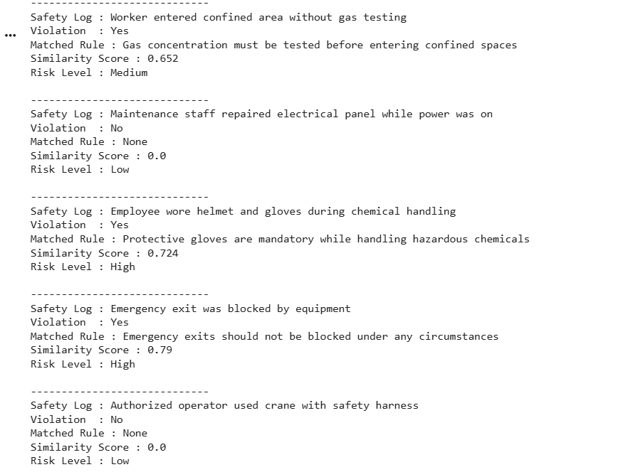

# 🦺 Safety Rule Checking using Semantic Similarity
 
An NLP-based safety compliance system that automatically detects workplace safety violations by comparing activity logs against predefined safety rules using **sentence embeddings** and **cosine similarity**. Built with `sentence-transformers` and zero-shot learning — no labeled dataset required.
 
<p align="center">
  
</p>
 
---
 
## 📌 Overview
 
Manual safety audits are time-consuming and prone to human error. This project automates the process by semantically matching worker activity logs against a set of safety rules to flag potential violations, assign matched rules, and categorize risk levels.
 
The system uses a pre-trained transformer model (`all-MiniLM-L6-v2`) to encode both safety rules and activity logs into vector embeddings, then measures their semantic closeness using cosine similarity — no fine-tuning or labeled training data needed.
 
Potential use cases include:
- Construction site compliance monitoring
- Industrial facility safety audits
- Automated incident report screening
- Real-time IoT log analysis for workplace safety
 
---
 
## ✅ Best Results
 
| Property | Value |
|---|---|
| Model | `all-MiniLM-L6-v2` (SentenceTransformers) |
| Approach | Zero-shot semantic similarity |
| Similarity Metric | Cosine Similarity |
| Violation Threshold | 0.60 |
| Risk Levels | Low / Medium / High / Critical |
| Output | DataFrame + CSV report |
 
> Logs scoring **≥ 0.60** similarity to any rule are flagged as violations.
> Risk level escalates at **> 0.70** (High) and **> 0.80** (Critical).
 
---
 
## 🧪 Sample Output
 
| Safety Log | Violation | Matched Rule | Similarity Score | Risk Level |
|---|---|---|---|---|
| Worker entered confined area without gas testing | Yes | Gas concentration must be tested before entering confined spaces | 0.81 | Critical |
| Maintenance staff repaired electrical panel while power was on | Yes | Electrical equipment must be switched off before maintenance | 0.76 | High |
| Employee wore helmet and gloves during chemical handling | No | — | — | Low |
| Emergency exit was blocked by equipment | Yes | Emergency exits should not be blocked under any circumstances | 0.79 | High |
| Authorized operator used crane with safety harness | No | — | — | Low |
 
---
 
## 🗂️ Project Structure
 
```
safety-rule-checking/
│
├── Safety_rule_checking.ipynb     # Main notebook
├── safety_violation_results.csv   # Output report
└── README.md
```
 
---
 
## ⚙️ Setup & Installation
 
### Prerequisites
- Python 3.8+
- Google Colab (recommended) or a local environment
 
### Install Dependencies
 
```bash
pip install sentence-transformers nltk pandas numpy scikit-learn
```
 
### NLTK Downloads
 
```python
import nltk
nltk.download('punkt')
nltk.download('stopwords')
nltk.download('punkt_tab')
```
 
---
 
## 🚀 How It Works
 
### 1. Define Safety Rules
 
```python
safety_rules = [
    "Workers must wear safety helmets at all times inside the construction site",
    "Gas concentration must be tested before entering confined spaces",
    "Employees must not operate heavy machinery without authorization",
    "Protective gloves are mandatory while handling hazardous chemicals",
    "Emergency exits should not be blocked under any circumstances",
    "Workers must wear safety harnesses when working at heights",
    "Electrical equipment must be switched off before maintenance",
]
```
 
### 2. Preprocess & Encode
 
```python
from sentence_transformers import SentenceTransformer
 
model = SentenceTransformer("all-MiniLM-L6-v2")
rule_embeddings = model.encode(processed_rules, convert_to_tensor=True)
log_embeddings  = model.encode(processed_logs,  convert_to_tensor=True)
```
 
### 3. Compute Similarity & Flag Violations
 
```python
from sentence_transformers import util
 
THRESHOLD = 0.60
similarity_matrix = util.cos_sim(log_embeddings, rule_embeddings)
 
# Logs exceeding threshold are flagged with matched rule + risk level
```
 
### 4. Export Results
 
```python
df_results.to_csv("safety_violation_results.csv", index=False)
```
 
---
 
## 📊 Risk Level Classification
 
| Similarity Score | Risk Level |
|---|---|
| `< 0.60` | ✅ Low (No Violation) |
| `0.60 – 0.70` | 🟡 Medium |
| `0.70 – 0.80` | 🟠 High |
| `> 0.80` | 🔴 Critical |
 
---
 
## 🧠 Key Characteristics
 
- **Zero-shot learning** — works without any labeled training data
- **Semantic understanding** — catches paraphrased or indirect violations, not just keyword matches
- **Threshold-based decisions** — easily tunable sensitivity
- **Extensible** — add new safety rules without retraining anything
 
---
 
## 🔭 Future Work
 
- [ ] Expand the safety rules database with domain-specific rule sets (mining, healthcare, manufacturing)
- [ ] Test with real-world incident report datasets
- [ ] Build a real-time log ingestion pipeline (Kafka, REST API)
- [ ] Add explainability — highlight which words triggered the match
- [ ] Experiment with larger models (`all-mpnet-base-v2`, domain-fine-tuned BERT)
- [ ] Deploy as a web app with Gradio or Streamlit
 
---
 
## 📚 References & Related Work
 
- [Sentence Transformers Documentation](https://www.sbert.net/)
- [all-MiniLM-L6-v2 on HuggingFace](https://huggingface.co/sentence-transformers/all-MiniLM-L6-v2)
- [Cosine Similarity — Scikit-learn](https://scikit-learn.org/stable/modules/metrics.html#cosine-similarity)
- [NLTK Documentation](https://www.nltk.org/)
 
---
 
## 🛠️ Tech Stack
 


 
---
